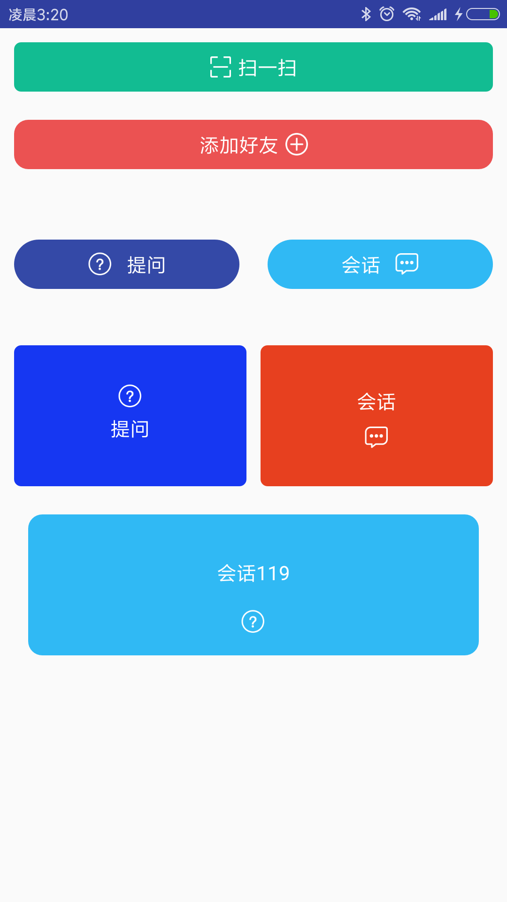

# Sample

# 使用
- 将library作为一个Module导入AS工程,build.gradle文件里添加依赖  compile project(path: ':library') 即可
#
    dependencies {
            compile project(path: ':library')
    }

### 自定义属性
- app:normalColor="#30b9f4" 默认颜色
- app:pressColor="#bc40e6"  按下时颜色
- app:radius="10dp"         圆角大小

